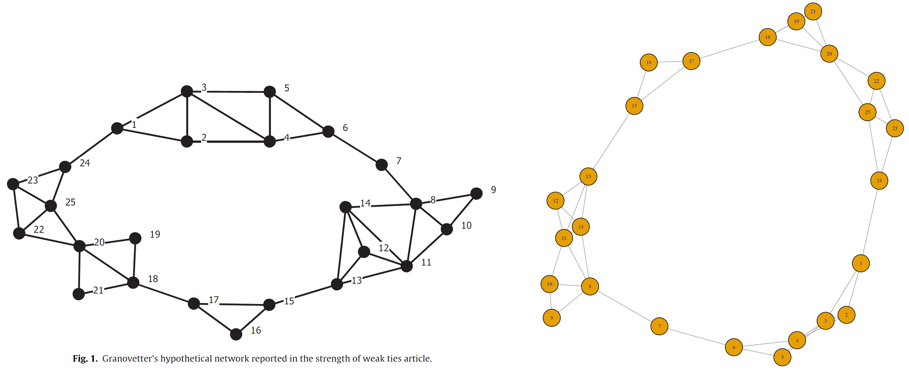
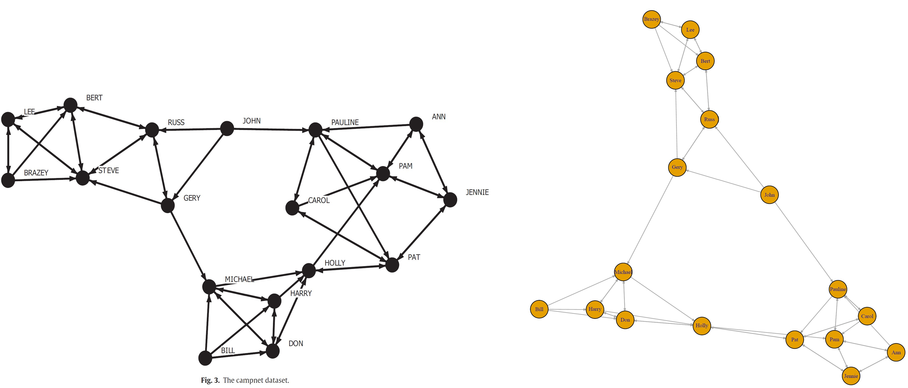

# EV Brokerage 

Using betweenness centrality as an underpinning concept, *Everett and Valente (2016)* propose a new brokerage measure and explore its relationship to classic betweenness.

This package contains simple R code for calculating *Everett and Valente (2016)* brokerage scores for both undirected and directed graphs.

For more information about the brokerage measure, see:

**Everett MG, Valente TW.** *Bridging, brokerage, and betweenness.* Social Networks. 2016; 44:202-208. DOI: [10.1016/j.socnet.2015.09.001](https://doi.org/10.1016/j.socnet.2015.09.001)

## Installation

Clone the repository to your local machine:

`git clone https://github.com/babak2/EV-brokerage.git`

or if you have the program as a ZIP file, simply extract the zip file to a directory of your choice.

Change your working directory to EV-brokerage:

`cd EV-brokerage`

## Program Requirements

R or RStudio with the following libraries installed: 
`tidygraph`, `igraph`, `ggraph`

# Usage

Open EV-brokerage.R in R or RStudio

## Inputs/Parameters: 

`g`: a graph (of type igraph or tidygraph).

`as.graph` (optional): By default, the result is returned as a data frame. To obtain the result as a graph, set as.graph to TRUE.

`all.values` (optional): By default, it is set to FALSE. If set to TRUE, it will include all the other calculated values in addition to EV brokerage scores.

`as.graph` (optional): By default, the results are returned as a DataFrame; if set to TRUE, the output will be returned as a graph.

## Output/Returns: 

The score as a DataFrame (by default) or as a graph if as.graph is set to TRUE.

If the original graph has original IDs (names), the results will include the original IDs (names).

## Provided RDS data: 

`granovetter_graph.RDS`: This dataset contains the undirected graph of the Granovetter hypothetical network as shown in Figure 1 of Everett & Valente (2016) article

`campnet_graph.RDS`: This dataset contains the directed graph of the Campnet hypothetical network as shown in Figure 3 of Everett & Valente (2016) article.

## Examples:

g <- readRDS("granovetter_graph.RDS") 

g <- readRDS("campnet_graph.RDS")     

res.df <- ev_brokerage(g)

to have the result as graph: 
res.g  <- ev_brokerage(g, as.graph=TRUE)

use all.values=TRUE to include other calulated values in addition to EV brokerage scores:
res.df  <- ev_brokerage(g, all.values=TRUE) 

## License

This program is licensed under the GNU GENERAL PUBLIC LICENSE. See LICENSE for more information.

## Author 

Babak Mahdavi Ardestani

babak.m.ardestani@gmail.com